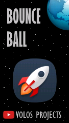

# esp32-breakout-TTGO

All the credits go to [Volos Projects](https://www.youtube.com/channel/UCit2rVgOvhyuAD-VH5H_IHg).

Initially just made this repository to easy upload the game using PlatformIO.
However over time stared to refactor the game to make it more readable/understandable for myself.

Changes:
- The splash screen has been converted back to BMP and is stored as a GZIP image.
- Structures for ball(speed), and tiles, reorganized the tile
- New names for variables
- Checking if all the tiles are hit instead of checking the score
- ...

See the original video on YouTube:

